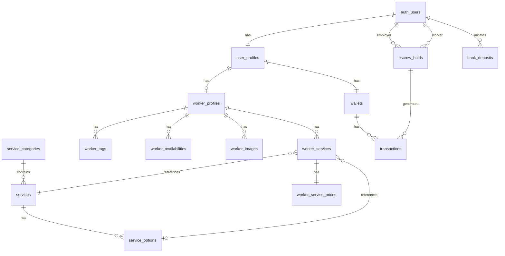
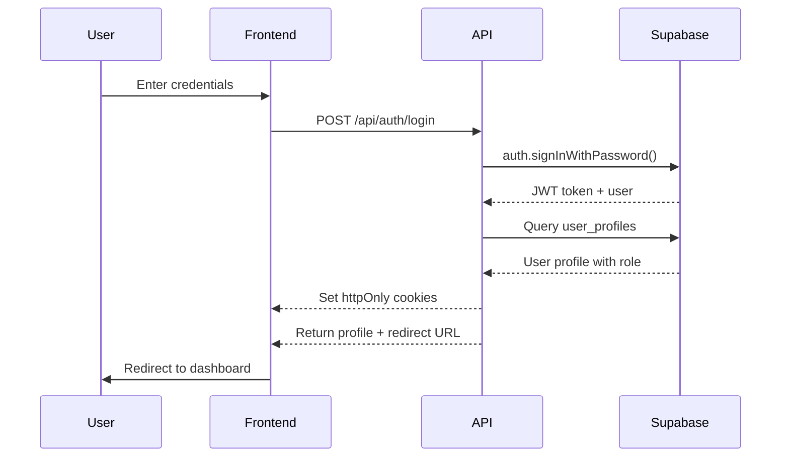
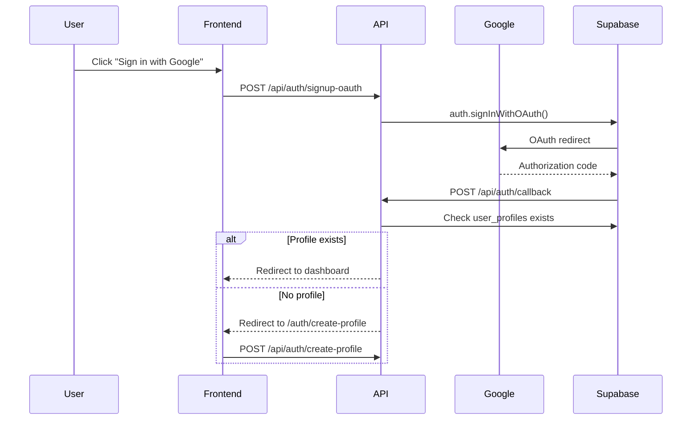
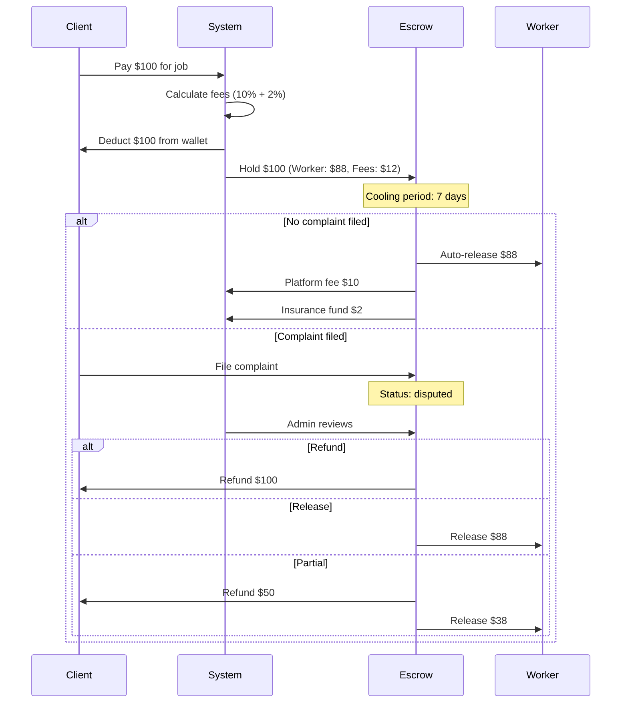

# PR1AS - Complete Memory Bank & Technical Documentation

**Generated**: 2025-11-21
**Version**: 1.0
**Status**: Production-Ready

---

## Table of Contents

1. [Project Overview](#1-project-overview)
2. [Technology Stack](#2-technology-stack)
3. [System Architecture](#3-system-architecture)
4. [Database Schema](#4-database-schema)
5. [Backend Architecture](#5-backend-architecture)
6. [Frontend Architecture](#6-frontend-architecture)
7. [API Documentation](#7-api-documentation)
8. [Authentication & Authorization](#8-authentication--authorization)
9. [Key Features & Workflows](#9-key-features--workflows)
10. [Deployment & Configuration](#10-deployment--configuration)
11. [Development Guidelines](#11-development-guidelines)

---

## 1. Project Overview

### 1.1 Project Description

**PR1AS** is a comprehensive marketplace platform connecting **Clients** with **Workers** for various services. The platform facilitates:

- Worker profile creation and management
- Service catalog with multi-category support
- Secure payment processing with escrow system
- Multi-language support (Vietnamese, English, Chinese, Korean)
- Role-based access control (Admin, Client, Worker)
- Real-time wallet and transaction management

### 1.2 Project Statistics

- **Total Files**: 200+ TypeScript/React files
- **Lines of Code**: ~20,000+ lines
- **API Endpoints**: 44+
- **Database Tables**: 17
- **Supported Languages**: 4
- **UI Components**: 30+
- **Pages**: 15

### 1.3 Team Roles

- **Admin**: Platform management, user approval, dispute resolution
- **Client**: Service consumers, job creators, payment initiators
- **Worker**: Service providers, profile management, earnings

---

## 2. Technology Stack

### 2.1 Core Framework

| Technology | Version | Purpose |
|------------|---------|---------|
| Next.js | 16.0.3 | Full-stack React framework with App Router |
| React | 19.2.0 | UI library |
| TypeScript | 5.x | Type safety |
| Node.js | 20.x | Runtime environment |

### 2.2 Backend Technologies

| Technology | Version | Purpose |
|------------|---------|---------|
| Supabase | 2.81.1 | Database (PostgreSQL), Auth, Storage |
| @supabase/ssr | 0.7.0 | Server-side rendering support |
| Day.js | 1.11.19 | Date manipulation |

### 2.3 Frontend Technologies

| Technology | Version | Purpose |
|------------|---------|---------|
| Ant Design | 5.28.1 | UI component library |
| Tailwind CSS | 4.x | Utility-first CSS |
| i18next | 25.6.2 | Internationalization |
| react-i18next | 16.3.3 | React i18n bindings |

### 2.4 Development Tools

| Tool | Purpose |
|------|---------|
| ESLint | Code linting |
| TypeScript | Type checking |
| PostCSS | CSS processing |
| Vercel | Deployment platform |

---

## 3. System Architecture

### 3.1 High-Level Architecture

```
┌─────────────────────────────────────────────────────────────┐
│                         Client Layer                         │
│  (Browser - React 19 + Next.js 16 App Router)              │
│  - Pages (15)                                               │
│  - Components (30+)                                         │
│  - API Clients                                              │
└────────────────────┬────────────────────────────────────────┘
                     │ HTTPS/REST
┌────────────────────▼────────────────────────────────────────┐
│                    Next.js API Routes                        │
│  - Authentication (7 endpoints)                             │
│  - Wallet & Payments (9 endpoints)                          │
│  - Worker Management (10 endpoints)                         │
│  - Admin Operations (12 endpoints)                          │
│  - Service Catalog (4 endpoints)                            │
└────────────────────┬────────────────────────────────────────┘
                     │
┌────────────────────▼────────────────────────────────────────┐
│                    Service Layer                             │
│  - WalletService                                            │
│  - WorkerProfileService                                     │
│  - AuthHelpers                                              │
└────────────────────┬────────────────────────────────────────┘
                     │
┌────────────────────▼────────────────────────────────────────┐
│                  Supabase PostgreSQL                         │
│  - User Management (auth.users, user_profiles)              │
│  - Service System (services, categories, options)           │
│  - Worker Profiles (profiles, images, services)             │
│  - Wallet System (wallets, transactions, escrows)           │
│  - Settings (platform_settings, site_settings)              │
└─────────────────────────────────────────────────────────────┘

┌─────────────────────────────────────────────────────────────┐
│                  External Integrations                       │
│  - Supabase Storage (Image uploads)                         │
│  - PayPal API (Deposits/Withdrawals)                        │
│  - Sepay API (Vietnamese bank transfers)                    │
│  - Google OAuth (Authentication)                            │
└─────────────────────────────────────────────────────────────┘

┌─────────────────────────────────────────────────────────────┐
│                   Background Jobs                            │
│  - Escrow Auto-Release (Hourly)                            │
│  - Deposit Expiration (Every 30 min)                        │
└─────────────────────────────────────────────────────────────┘
```

### 3.2 Architecture Pattern

**Pattern**: Modular Monolith with Service Layer

**Key Characteristics**:
- File-based routing (Next.js App Router)
- API routes as backend controllers
- Service layer for business logic
- Direct database access via Supabase client
- No ORM (uses Supabase SDK)
- Row-Level Security (RLS) at database level

---

## 4. Database Schema

### 4.1 Schema Overview

**Total Tables**: 17
**Database**: PostgreSQL (Supabase)
**Authentication**: Supabase Auth (built-in)

### 4.2 Core Tables

#### A. Authentication & Users

##### 1. `auth.users` (Supabase Built-in)
- Managed by Supabase Auth
- Stores credentials, OAuth data

##### 2. `user_profiles`
```sql
CREATE TABLE user_profiles (
  id UUID PRIMARY KEY REFERENCES auth.users(id),
  email TEXT UNIQUE NOT NULL,
  role TEXT NOT NULL CHECK (role IN ('client', 'worker', 'admin')),
  status TEXT NOT NULL DEFAULT 'active' CHECK (status IN ('active', 'banned')),
  created_at TIMESTAMPTZ DEFAULT NOW(),
  updated_at TIMESTAMPTZ DEFAULT NOW()
);
```
**Purpose**: Extended user information with role-based access

---

#### B. Service System

##### 3. `service_categories`
```sql
CREATE TABLE service_categories (
  id UUID PRIMARY KEY DEFAULT gen_random_uuid(),
  name_key TEXT NOT NULL, -- i18n key: 'CATEGORY_HOMECARE'
  slug TEXT UNIQUE NOT NULL,
  description TEXT,
  icon TEXT,
  display_order INTEGER DEFAULT 0,
  is_active BOOLEAN DEFAULT true,
  created_at TIMESTAMPTZ DEFAULT NOW(),
  updated_at TIMESTAMPTZ DEFAULT NOW()
);
```
**Sample Categories**: Homecare, Grooming, Assistance, Companionship

##### 4. `services`
```sql
CREATE TABLE services (
  id UUID PRIMARY KEY DEFAULT gen_random_uuid(),
  category_id UUID REFERENCES service_categories(id),
  name_key TEXT NOT NULL, -- i18n key: 'SERVICE_HOMECARE_COOKING'
  slug TEXT UNIQUE NOT NULL,
  description TEXT,
  icon TEXT,
  has_options BOOLEAN DEFAULT false,
  parent_service_id UUID REFERENCES services(id),
  display_order INTEGER DEFAULT 0,
  is_active BOOLEAN DEFAULT true,
  requires_certification BOOLEAN DEFAULT false,
  metadata JSONB,
  created_at TIMESTAMPTZ DEFAULT NOW(),
  updated_at TIMESTAMPTZ DEFAULT NOW()
);
```

##### 5. `service_options`
```sql
CREATE TABLE service_options (
  id UUID PRIMARY KEY DEFAULT gen_random_uuid(),
  service_id UUID REFERENCES services(id),
  option_key TEXT NOT NULL, -- 'COOKING_VIETNAMESE'
  option_type TEXT NOT NULL, -- 'cuisine', 'language_pair'
  option_value TEXT NOT NULL, -- 'vietnamese', 'EN_TO_JA'
  display_order INTEGER DEFAULT 0,
  is_active BOOLEAN DEFAULT true,
  metadata JSONB,
  created_at TIMESTAMPTZ DEFAULT NOW(),
  updated_at TIMESTAMPTZ DEFAULT NOW()
);
```

---

#### C. Worker Profiles

##### 6. `worker_profiles`
```sql
CREATE TABLE worker_profiles (
  id UUID PRIMARY KEY DEFAULT gen_random_uuid(),
  user_id UUID UNIQUE REFERENCES user_profiles(id) ON DELETE CASCADE,
  full_name TEXT NOT NULL,
  nickname TEXT,
  age INTEGER CHECK (age >= 18 AND age <= 100),
  height_cm INTEGER,
  weight_kg INTEGER,
  zodiac_sign TEXT,
  lifestyle TEXT, -- i18n key
  personal_quote TEXT,
  bio TEXT,
  profile_status TEXT DEFAULT 'draft' CHECK (profile_status IN
    ('draft', 'pending', 'approved', 'rejected', 'published')),
  profile_completed_steps INTEGER DEFAULT 0, -- bitmask: 1=step1, 2=step2, 3=both
  reviewed_by UUID REFERENCES auth.users(id),
  reviewed_at TIMESTAMPTZ,
  rejection_reason TEXT,
  metadata JSONB,
  created_at TIMESTAMPTZ DEFAULT NOW(),
  updated_at TIMESTAMPTZ DEFAULT NOW()
);
```

**Profile Workflow**:
1. `draft` - Worker creating profile
2. `pending` - Submitted for admin review
3. `approved` - Admin approved
4. `published` - Publicly visible
5. `rejected` - Admin rejected

##### 7. `worker_tags`
```sql
CREATE TABLE worker_tags (
  id UUID PRIMARY KEY DEFAULT gen_random_uuid(),
  worker_profile_id UUID REFERENCES worker_profiles(id) ON DELETE CASCADE,
  tag_key TEXT NOT NULL, -- 'TAG_SPORTS'
  tag_value TEXT,
  tag_type TEXT CHECK (tag_type IN ('interest', 'hobby', 'skill')),
  created_at TIMESTAMPTZ DEFAULT NOW()
);
```

##### 8. `worker_availabilities`
```sql
CREATE TABLE worker_availabilities (
  id UUID PRIMARY KEY DEFAULT gen_random_uuid(),
  worker_profile_id UUID REFERENCES worker_profiles(id) ON DELETE CASCADE,
  day_of_week INTEGER CHECK (day_of_week BETWEEN 1 AND 7), -- 1=Monday
  availability_type TEXT CHECK (availability_type IN
    ('all_day', 'time_range', 'not_available')),
  start_time TIME,
  end_time TIME,
  notes TEXT,
  created_at TIMESTAMPTZ DEFAULT NOW(),
  updated_at TIMESTAMPTZ DEFAULT NOW()
);
```

##### 9. `worker_images`
```sql
CREATE TABLE worker_images (
  id UUID PRIMARY KEY DEFAULT gen_random_uuid(),
  worker_profile_id UUID REFERENCES worker_profiles(id) ON DELETE CASCADE,
  image_url TEXT NOT NULL,
  image_type TEXT CHECK (image_type IN ('avatar', 'gallery')),
  display_order INTEGER DEFAULT 0,
  file_name TEXT,
  file_size_bytes INTEGER,
  mime_type TEXT,
  width_px INTEGER,
  height_px INTEGER,
  is_approved BOOLEAN DEFAULT false,
  approved_by UUID REFERENCES auth.users(id),
  approved_at TIMESTAMPTZ,
  created_at TIMESTAMPTZ DEFAULT NOW(),
  updated_at TIMESTAMPTZ DEFAULT NOW()
);
```

##### 10. `worker_services`
```sql
CREATE TABLE worker_services (
  id UUID PRIMARY KEY DEFAULT gen_random_uuid(),
  worker_profile_id UUID REFERENCES worker_profiles(id) ON DELETE CASCADE,
  service_id UUID REFERENCES services(id),
  service_option_id UUID REFERENCES service_options(id),
  is_active BOOLEAN DEFAULT true,
  is_featured BOOLEAN DEFAULT false,
  created_at TIMESTAMPTZ DEFAULT NOW(),
  updated_at TIMESTAMPTZ DEFAULT NOW(),
  UNIQUE(worker_profile_id, service_id, service_option_id)
);
```

##### 11. `worker_service_prices`
```sql
CREATE TABLE worker_service_prices (
  id UUID PRIMARY KEY DEFAULT gen_random_uuid(),
  worker_service_id UUID UNIQUE REFERENCES worker_services(id) ON DELETE CASCADE,
  price_usd DECIMAL(10,2) NOT NULL,
  price_vnd DECIMAL(15,2),
  price_jpy DECIMAL(10,2),
  price_krw DECIMAL(10,2),
  price_cny DECIMAL(10,2),
  primary_currency TEXT DEFAULT 'USD' CHECK (primary_currency IN
    ('USD', 'VND', 'JPY', 'KRW', 'CNY')),
  daily_discount_percent DECIMAL(5,2) DEFAULT 5.00,
  weekly_discount_percent DECIMAL(5,2) DEFAULT 10.00,
  monthly_discount_percent DECIMAL(5,2) DEFAULT 15.00,
  is_active BOOLEAN DEFAULT true,
  notes TEXT,
  metadata JSONB,
  created_at TIMESTAMPTZ DEFAULT NOW(),
  updated_at TIMESTAMPTZ DEFAULT NOW()
);
```

**Pricing Formula**:
- **Daily Rate**: `hourly_rate * 8 * (1 - daily_discount_percent / 100)`
- **Weekly Rate**: `hourly_rate * 56 * (1 - weekly_discount_percent / 100)`
- **Monthly Rate**: `hourly_rate * 160 * (1 - monthly_discount_percent / 100)`

---

#### D. Wallet & Payment System

##### 12. `wallets`
```sql
CREATE TABLE wallets (
  id UUID PRIMARY KEY DEFAULT gen_random_uuid(),
  user_id UUID UNIQUE REFERENCES auth.users(id) ON DELETE CASCADE,
  balance_usd DECIMAL(10,2) DEFAULT 0.00 CHECK (balance_usd >= 0),
  pending_usd DECIMAL(10,2) DEFAULT 0.00 CHECK (pending_usd >= 0),
  total_earned_usd DECIMAL(10,2) DEFAULT 0.00,
  total_spent_usd DECIMAL(10,2) DEFAULT 0.00,
  currency TEXT DEFAULT 'USD',
  status TEXT DEFAULT 'active' CHECK (status IN
    ('active', 'frozen', 'suspended')),
  created_at TIMESTAMPTZ DEFAULT NOW(),
  updated_at TIMESTAMPTZ DEFAULT NOW()
);
```

##### 13. `transactions`
```sql
CREATE TABLE transactions (
  id UUID PRIMARY KEY DEFAULT gen_random_uuid(),
  user_id UUID REFERENCES auth.users(id),
  wallet_id UUID REFERENCES wallets(id),
  type TEXT NOT NULL CHECK (type IN (
    'deposit', 'withdrawal', 'payment', 'earning',
    'platform_fee', 'insurance_fee', 'refund',
    'escrow_hold', 'escrow_release'
  )),
  amount_usd DECIMAL(10,2) NOT NULL,
  balance_before_usd DECIMAL(10,2),
  balance_after_usd DECIMAL(10,2),
  payment_method TEXT CHECK (payment_method IN
    ('paypal', 'bank_transfer', 'escrow', 'internal')),
  payment_gateway_id TEXT,
  status TEXT DEFAULT 'pending' CHECK (status IN
    ('pending', 'processing', 'completed', 'failed', 'cancelled')),
  escrow_id UUID REFERENCES escrow_holds(id),
  job_id UUID,
  related_user_id UUID REFERENCES auth.users(id),
  description TEXT,
  metadata JSONB,
  created_at TIMESTAMPTZ DEFAULT NOW(),
  completed_at TIMESTAMPTZ,
  failed_at TIMESTAMPTZ
);
```

##### 14. `escrow_holds`
```sql
CREATE TABLE escrow_holds (
  id UUID PRIMARY KEY DEFAULT gen_random_uuid(),
  employer_id UUID REFERENCES auth.users(id),
  worker_id UUID REFERENCES auth.users(id),
  job_id UUID,
  total_amount_usd DECIMAL(10,2) NOT NULL,
  platform_fee_usd DECIMAL(10,2) DEFAULT 0.00,
  insurance_fee_usd DECIMAL(10,2) DEFAULT 0.00,
  worker_amount_usd DECIMAL(10,2) NOT NULL,
  status TEXT DEFAULT 'held' CHECK (status IN
    ('held', 'released', 'refunded', 'disputed', 'cancelled')),
  payment_transaction_id UUID REFERENCES transactions(id),
  release_transaction_id UUID REFERENCES transactions(id),
  cooling_period_days INTEGER DEFAULT 7,
  hold_until TIMESTAMPTZ NOT NULL, -- Auto-release date
  has_complaint BOOLEAN DEFAULT false,
  complaint_description TEXT,
  complaint_filed_at TIMESTAMPTZ,
  resolution_notes TEXT,
  resolved_by UUID REFERENCES auth.users(id),
  created_at TIMESTAMPTZ DEFAULT NOW(),
  released_at TIMESTAMPTZ,
  updated_at TIMESTAMPTZ DEFAULT NOW()
);
```

**Escrow Workflow**:
1. Client pays → Funds go to escrow (status: `held`)
2. Cooling period (7 days default)
3. Auto-release after `hold_until` OR manual release
4. Complaint → Admin resolution (refund/release/partial)

##### 15. `bank_deposits`
```sql
CREATE TABLE bank_deposits (
  id UUID PRIMARY KEY DEFAULT gen_random_uuid(),
  user_id UUID REFERENCES auth.users(id),
  amount_usd DECIMAL(10,2) NOT NULL,
  amount_vnd DECIMAL(15,2) NOT NULL,
  qr_code_url TEXT,
  bank_account TEXT,
  bank_name TEXT,
  transfer_content TEXT UNIQUE NOT NULL, -- e.g., 'ND73333'
  status TEXT DEFAULT 'pending' CHECK (status IN
    ('pending', 'verifying', 'completed', 'expired', 'failed')),
  webhook_received BOOLEAN DEFAULT false,
  webhook_data JSONB,
  bank_reference_code TEXT,
  bank_transaction_id BIGINT,
  transaction_id UUID REFERENCES transactions(id),
  created_at TIMESTAMPTZ DEFAULT NOW(),
  expires_at TIMESTAMPTZ NOT NULL, -- 30 min expiry
  verified_at TIMESTAMPTZ,
  completed_at TIMESTAMPTZ
);
```

##### 16. `platform_settings`
```sql
CREATE TABLE platform_settings (
  id UUID PRIMARY KEY DEFAULT gen_random_uuid(),
  key TEXT UNIQUE NOT NULL,
  value JSONB NOT NULL,
  description TEXT,
  updated_by UUID REFERENCES auth.users(id),
  created_at TIMESTAMPTZ DEFAULT NOW(),
  updated_at TIMESTAMPTZ DEFAULT NOW()
);
```

**Default Settings**:
```json
{
  "payment_fees_enabled": true,
  "platform_fee_percentage": 10,
  "insurance_fund_percentage": 2,
  "escrow_cooling_period_days": 7,
  "minimum_deposit_usd": 10,
  "minimum_withdrawal_usd": 20
}
```

---

#### E. Site Configuration

##### 17. `site_settings`
```sql
CREATE TABLE site_settings (
  id UUID PRIMARY KEY DEFAULT gen_random_uuid(),
  key TEXT UNIQUE NOT NULL,
  value JSONB NOT NULL,
  created_at TIMESTAMPTZ DEFAULT NOW(),
  updated_at TIMESTAMPTZ DEFAULT NOW()
);
```

**Settings Keys**:
- `seo` - SEO metadata (title, description, keywords, og_image)
- `header` - Logo, tagline
- `footer` - Company info, address, social links

---

### 4.3 Entity Relationship Diagram



---

## 5. Backend Architecture

### 5.1 Directory Structure

```
/app/api/
├── admin/              # Admin operations
│   ├── users/          # User management (ban, approve, delete)
│   ├── wallet/         # Wallet management & escrow resolution
│   └── settings/       # Platform settings
├── auth/               # Authentication
│   ├── login/          # Email/password login
│   ├── signup/         # Registration
│   ├── callback/       # OAuth callback
│   └── profile/        # User profile
├── wallet/             # Wallet & payments
│   ├── balance/        # Get balance
│   ├── deposit/        # Deposit funds
│   ├── withdraw/       # Withdraw funds
│   ├── payment/        # Pay worker (create escrow)
│   ├── transactions/   # Transaction history
│   ├── escrow/         # View escrows & file complaints
│   ├── fees/           # Calculate fees
│   └── webhook/        # Payment webhooks
├── worker/             # Worker profile management
│   ├── profile/        # Profile CRUD
│   ├── services/       # Service management
│   └── images/         # Image uploads
├── services/           # Service catalog
├── upload/             # File uploads
└── cron/               # Background jobs
    ├── release-escrows/    # Hourly
    └── expire-deposits/    # Every 30 min

/lib/                   # Service layer
├── auth/
│   ├── helpers.ts      # Server-side auth utilities
│   └── api-client.ts   # Client-side API wrapper
├── wallet/
│   ├── service.ts      # WalletService class
│   ├── types.ts        # TypeScript interfaces
│   └── api-client.ts   # Client-side API wrapper
├── worker/
│   ├── service.ts      # WorkerProfileService class
│   └── api-client.ts   # Client-side API wrapper
├── supabase/
│   ├── server.ts       # Server-side Supabase client
│   └── client.ts       # Client-side Supabase client
└── utils/
    ├── enums.ts        # Enums & constants
    └── common.ts       # Helper functions
```

### 5.2 Service Layer Classes

#### A. WalletService (`/lib/wallet/service.ts`)

**Purpose**: Business logic for wallet operations

**Key Methods**:
```typescript
class WalletService {
  // Settings
  async getPlatformSettings(): Promise<PlatformSettings>
  async updatePlatformSetting(key: string, value: any): Promise<void>

  // Wallet Management
  async getOrCreateWallet(userId: string): Promise<Wallet>
  async getWalletSummary(userId: string): Promise<WalletSummary>

  // Transactions
  async createTransaction(data: TransactionData): Promise<Transaction>
  async getTransactions(filters: TransactionFilters): Promise<Transaction[]>

  // Payments & Escrow
  async processPayment(payment: PaymentRequest): Promise<EscrowHold>
  async releaseEscrow(escrowId: string): Promise<void>
  async fileComplaint(escrowId: string, description: string): Promise<void>
  async resolveComplaint(resolution: ComplaintResolution): Promise<void>

  // Background Jobs
  async getEscrowsReadyForRelease(): Promise<EscrowHold[]>
  async expirePendingDeposits(): Promise<void>

  // Admin
  async getAdminStats(): Promise<AdminWalletStats>
}
```

#### B. WorkerProfileService (`/lib/worker/service.ts`)

**Purpose**: Worker profile management

**Key Methods**:
```typescript
class WorkerProfileService {
  // Services
  async getServiceCategories(): Promise<ServiceCategory[]>
  async getServices(categoryId?: string): Promise<Service[]>

  // Profile Management
  async saveWorkerProfile(userId: string, data: ProfileData): Promise<WorkerProfile>
  async getWorkerProfile(userId: string): Promise<WorkerProfile>
  async submitProfileForReview(userId: string): Promise<void>
  async publishProfile(userId: string): Promise<void>

  // Worker Services
  async addWorkerService(data: WorkerServiceData): Promise<WorkerService>
  async updateWorkerServicePrice(serviceId: string, pricing: PriceData): Promise<void>
  async removeWorkerService(serviceId: string): Promise<void>

  // Pricing
  calculatePriceTiers(hourlyRate: number, discounts: Discounts): PriceTiers
}
```

---

### 5.3 API Route Pattern

**File**: `/app/api/[module]/[endpoint]/route.ts`

**Example**: `/app/api/wallet/payment/route.ts`

```typescript
import { NextRequest, NextResponse } from "next/server";
import { getAuthenticatedUser } from "@/lib/wallet/auth-helper";
import { WalletService } from "@/lib/wallet/service";
import { createClient } from "@/lib/supabase/server";

export async function POST(request: NextRequest) {
  try {
    // 1. Authentication
    const { user, supabase, error } = await getAuthenticatedUser(request);
    if (error || !user.id) {
      return NextResponse.json(
        { error: "Unauthorized" },
        { status: 401 }
      );
    }

    // 2. Authorization (Role Check)
    const { data: profile } = await supabase
      .from("user_profiles")
      .select("role")
      .eq("id", user.id)
      .single();

    if (profile.role !== "client") {
      return NextResponse.json(
        { error: "Only clients can make payments" },
        { status: 403 }
      );
    }

    // 3. Parse Request Body
    const body = await request.json();
    const { workerId, amount, jobId } = body;

    // 4. Validation
    if (!workerId || !amount || amount <= 0) {
      return NextResponse.json(
        { error: "Invalid payment data" },
        { status: 400 }
      );
    }

    // 5. Business Logic (Service Layer)
    const walletService = new WalletService(supabase);
    const escrow = await walletService.processPayment({
      employerId: user.id,
      workerId,
      amount,
      jobId,
    });

    // 6. Response
    return NextResponse.json({
      success: true,
      escrow,
    });
  } catch (error) {
    console.error("Payment error:", error);
    return NextResponse.json(
      { error: "Internal server error" },
      { status: 500 }
    );
  }
}
```

---

### 5.4 Authentication Helper

**File**: `/lib/wallet/auth-helper.ts`

```typescript
export async function getAuthenticatedUser(request: NextRequest) {
  // Try Authorization header first
  const authHeader = request.headers.get("authorization");
  let token = authHeader?.replace("Bearer ", "");

  // Fallback to httpOnly cookie
  if (!token) {
    token = request.cookies.get("sb-access-token")?.value;
  }

  if (!token) {
    return { user: null, supabase: null, error: "No token" };
  }

  const supabase = createClient(token);
  const { data: { user }, error } = await supabase.auth.getUser();

  return { user, supabase, error };
}
```

---

## 6. Frontend Architecture

### 6.1 Directory Structure

```
/app/                   # Pages (Next.js App Router)
├── admin/              # Admin dashboard
├── auth/               # Login/Signup
├── client/             # Client dashboard
├── worker/             # Worker dashboard
└── layout.tsx          # Root layout

/components/            # Reusable components
├── common/             # Common UI (Loading, UserMenu, ImageUpload)
├── layout/             # MainLayout, Header, Footer
├── providers/          # I18nProvider, AntdProvider
├── wallet/             # WalletBalance, DepositModal, TransactionHistory
└── worker/             # Step1BasicInfo, Step2ServicesAndPricing

/features/              # Feature-specific components
└── home/               # Home page sections

/lib/                   # API clients & utilities
├── auth/api-client.ts
├── wallet/api-client.ts
└── worker/api-client.ts

/hooks/                 # Custom React hooks
├── useMobileSidebar.ts
└── useSiteSettings.ts

/i18n/                  # Internationalization
├── config.ts
└── /messages/          # Translation files (vi, en, zh, ko)
```

### 6.2 Page Structure

#### Root Layout (`/app/layout.tsx`)

```tsx
export default function RootLayout({ children }) {
  return (
    <html lang="vi" suppressHydrationWarning>
      <body>
        <I18nProvider>
          <AntdProvider>
            {children}
          </AntdProvider>
        </I18nProvider>
      </body>
    </html>
  );
}
```

#### Protected Layout Example (`/app/worker/layout.tsx`)

```tsx
export default function WorkerLayout({ children }) {
  return (
    <div className="min-h-screen">
      <WorkerSidebar />
      <main className="ml-0 lg:ml-64 p-6">
        {children}
      </main>
    </div>
  );
}
```

---

### 6.3 Component Patterns

#### A. API Data Fetching

```tsx
function WalletBalance() {
  const [balance, setBalance] = useState<WalletSummary | null>(null);
  const [loading, setLoading] = useState(true);

  useEffect(() => {
    async function fetchBalance() {
      try {
        const data = await walletAPI.getBalance();
        setBalance(data);
      } catch (error) {
        showMessage.error(t("wallet.errors.fetchFailed"));
      } finally {
        setLoading(false);
      }
    }
    fetchBalance();
  }, []);

  if (loading) return <SkeletonLoading />;

  return (
    <Card>
      <Statistic title="Available Balance" value={balance.balance_usd} prefix="$" />
    </Card>
  );
}
```

#### B. Form Handling

```tsx
function DepositForm({ onSuccess }) {
  const [form] = Form.useForm();
  const [loading, setLoading] = useState(false);

  const handleSubmit = async (values) => {
    setLoading(true);
    try {
      await walletAPI.depositBankTransfer(values.amount);
      showMessage.success(t("wallet.depositSuccess"));
      onSuccess?.();
    } catch (error) {
      showMessage.error(t("wallet.depositFailed"));
    } finally {
      setLoading(false);
    }
  };

  return (
    <Form form={form} onFinish={handleSubmit} layout="vertical">
      <Form.Item
        name="amount"
        label="Amount (USD)"
        rules={[
          { required: true, message: "Amount is required" },
          { type: "number", min: 10, message: "Minimum $10" }
        ]}
      >
        <InputNumber className="w-full" />
      </Form.Item>
      <Form.Item>
        <Button type="primary" htmlType="submit" loading={loading}>
          {t("common.submit")}
        </Button>
      </Form.Item>
    </Form>
  );
}
```

---

### 6.4 State Management

**Approach**: Local state + Custom hooks (No Redux/Zustand)

**Example Custom Hook**:

```typescript
// /hooks/useSiteSettings.ts
export function useSiteSettings() {
  const [settings, setSettings] = useState<SEOSettings | null>(null);
  const [loading, setLoading] = useState(true);
  const [error, setError] = useState<Error | null>(null);

  useEffect(() => {
    async function fetchSettings() {
      try {
        const response = await fetch("/api/admin/settings/seo");
        const data = await response.json();
        setSettings(data.settings);
      } catch (err) {
        setError(err as Error);
      } finally {
        setLoading(false);
      }
    }
    fetchSettings();
  }, []);

  return { settings, loading, error };
}
```

---

## 7. API Documentation

### 7.1 Authentication APIs

| Method | Endpoint | Auth | Purpose |
|--------|----------|------|---------|
| POST | `/api/auth/signup` | Public | Register new user |
| POST | `/api/auth/login` | Public | Login with credentials |
| POST | `/api/auth/logout` | Required | Logout |
| GET | `/api/auth/profile` | Required | Get user profile |
| POST | `/api/auth/create-profile` | Required | Create profile after OAuth |
| POST | `/api/auth/callback` | Public | OAuth callback handler |

**Example Request**: `POST /api/auth/signup`
```json
{
  "email": "user@example.com",
  "password": "SecurePass123",
  "role": "worker",
  "fullName": "John Doe"
}
```

**Example Response**:
```json
{
  "success": true,
  "user": {
    "id": "uuid",
    "email": "user@example.com",
    "role": "worker"
  },
  "redirectUrl": "/worker/dashboard"
}
```

---

### 7.2 Wallet APIs

| Method | Endpoint | Auth | Purpose |
|--------|----------|------|---------|
| GET | `/api/wallet/balance` | Required | Get wallet balance & summary |
| POST | `/api/wallet/deposit` | Required | Deposit funds (bank/PayPal) |
| POST | `/api/wallet/withdraw` | Required | Withdraw funds |
| POST | `/api/wallet/payment` | Client | Pay worker (creates escrow) |
| GET | `/api/wallet/transactions` | Required | Get transaction history |
| GET | `/api/wallet/escrow` | Required | View escrows |
| POST | `/api/wallet/escrow/complaint` | Required | File complaint |
| GET | `/api/wallet/fees` | Required | Calculate fees |

**Example Request**: `POST /api/wallet/payment`
```json
{
  "workerId": "worker-uuid",
  "amount": 100.00,
  "jobId": "job-uuid",
  "description": "Web development services"
}
```

**Example Response**:
```json
{
  "success": true,
  "escrow": {
    "id": "escrow-uuid",
    "total_amount_usd": 100.00,
    "platform_fee_usd": 10.00,
    "insurance_fee_usd": 2.00,
    "worker_amount_usd": 88.00,
    "status": "held",
    "hold_until": "2025-11-28T10:00:00Z"
  }
}
```

---

### 7.3 Worker Profile APIs

| Method | Endpoint | Auth | Purpose |
|--------|----------|------|---------|
| GET | `/api/worker/profile` | Worker | Get worker profile |
| POST | `/api/worker/profile` | Worker | Create/Update profile |
| POST | `/api/worker/profile/submit` | Worker | Submit for review |
| POST | `/api/worker/profile/publish` | Worker | Publish profile |
| GET | `/api/worker/services` | Worker | Get worker's services |
| POST | `/api/worker/services` | Worker | Add service |
| PUT | `/api/worker/services/[id]/price` | Worker | Update pricing |
| DELETE | `/api/worker/services/[id]` | Worker | Remove service |

**Example Request**: `POST /api/worker/services`
```json
{
  "serviceId": "service-uuid",
  "serviceOptionId": "option-uuid",
  "pricing": {
    "hourly_rate": 25.00,
    "daily_discount": 5,
    "weekly_discount": 10,
    "monthly_discount": 15
  }
}
```

---

### 7.4 Admin APIs

| Method | Endpoint | Auth | Purpose |
|--------|----------|------|---------|
| GET | `/api/admin/users` | Admin | List all users |
| GET | `/api/admin/users/pending-workers` | Admin | Pending approvals |
| POST | `/api/admin/users/approve-worker` | Admin | Approve worker |
| POST | `/api/admin/users/ban` | Admin | Ban user |
| POST | `/api/admin/users/unban` | Admin | Unban user |
| POST | `/api/admin/users/update-role` | Admin | Update role |
| DELETE | `/api/admin/users/delete` | Admin | Delete user |
| GET | `/api/admin/wallet/stats` | Admin | Platform statistics |
| GET | `/api/admin/wallet/settings` | Admin | Get settings |
| PUT | `/api/admin/wallet/settings` | Admin | Update settings |
| POST | `/api/admin/wallet/escrow/release` | Admin | Release escrow |
| POST | `/api/admin/wallet/escrow/resolve` | Admin | Resolve complaint |

---

## 8. Authentication & Authorization

### 8.1 Authentication Flow

#### A. Email/Password Flow



#### B. OAuth Flow



---

### 8.2 Authorization Middleware

**File**: `/middleware.ts`

```typescript
export async function middleware(request: NextRequest) {
  const { pathname } = request.nextUrl;

  // Extract token from cookie
  const token = request.cookies.get("sb-access-token")?.value;

  if (!token) {
    return NextResponse.redirect(new URL("/auth/login", request.url));
  }

  // Verify token with Supabase
  const supabase = createClient(token);
  const { data: { user }, error } = await supabase.auth.getUser();

  if (error || !user) {
    return NextResponse.redirect(new URL("/auth/login", request.url));
  }

  // Get user profile with role
  const { data: profile } = await supabase
    .from("user_profiles")
    .select("role, status")
    .eq("id", user.id)
    .single();

  // Check banned status
  if (profile?.status === "banned") {
    return NextResponse.redirect(new URL("/banned", request.url));
  }

  // Role-based route protection
  if (pathname.startsWith("/admin") && profile?.role !== "admin") {
    return NextResponse.redirect(new URL("/unauthorized", request.url));
  }

  if (pathname.startsWith("/worker") && profile?.role !== "worker") {
    return NextResponse.redirect(new URL("/unauthorized", request.url));
  }

  if (pathname.startsWith("/client") && profile?.role !== "client") {
    return NextResponse.redirect(new URL("/unauthorized", request.url));
  }

  return NextResponse.next();
}

export const config = {
  matcher: [
    "/((?!api|_next/static|_next/image|favicon.ico|.*\\..*|public).*)",
  ],
};
```

---

### 8.3 API Route Authorization

**Pattern**: Manual checks in each route

```typescript
// Example: Admin-only endpoint
export async function POST(request: NextRequest) {
  const { user, supabase } = await getAuthenticatedUser(request);

  const { data: profile } = await supabase
    .from("user_profiles")
    .select("role")
    .eq("id", user.id)
    .single();

  if (profile?.role !== "admin") {
    return NextResponse.json(
      { error: "Admin access required" },
      { status: 403 }
    );
  }

  // Admin operation here
}
```

---

## 9. Key Features & Workflows

### 9.1 Worker Profile Setup Workflow

#### Step 1: Basic Information
**Page**: `/worker/profile/setup`
**Status**: `draft`

**Fields**:
- Personal Info: Full name, nickname, age, height, weight
- Personal Details: Zodiac sign, lifestyle, quote, bio
- Tags: Interests, hobbies, skills (e.g., "Sports", "Reading")
- Availability: Weekly schedule with time ranges
- Images: Avatar + gallery photos (up to 10)

**Component**: `<Step1BasicInfo />`

---

#### Step 2: Services & Pricing
**Status**: `draft`

**Process**:
1. Select service category (e.g., "Homecare")
2. Select specific service (e.g., "Cooking")
3. Select option if applicable (e.g., "Vietnamese cuisine")
4. Set pricing:
   - Hourly rate (USD)
   - Daily discount (default 5%)
   - Weekly discount (default 10%)
   - Monthly discount (default 15%)

**Auto-calculated Rates**:
- Daily: `hourly * 8 * (1 - 0.05)`
- Weekly: `hourly * 56 * (1 - 0.10)`
- Monthly: `hourly * 160 * (1 - 0.15)`

**Component**: `<Step2ServicesAndPricing />`

---

#### Step 3: Submission & Review
**Status**: `pending` → `approved` → `published`

**Workflow**:
1. Worker clicks "Submit for Review"
   - API: `POST /api/worker/profile/submit`
   - Profile status → `pending`
   - Notification sent to admins

2. Admin reviews profile
   - View pending workers: `/admin/users` (tab: "Pending Workers")
   - Admin can:
     - Approve: `POST /api/admin/users/approve-worker`
     - Reject with reason

3. If approved, worker can publish
   - API: `POST /api/worker/profile/publish`
   - Profile status → `published`
   - Profile becomes publicly searchable

---

### 9.2 Payment & Escrow Workflow

#### A. Deposit Funds

**Method 1: Bank Transfer (Vietnamese)**
1. Client enters amount (USD)
2. System converts to VND (exchange rate from settings)
3. Generates Sepay QR code with unique transfer code
4. Client scans QR and transfers via banking app
5. Sepay webhook confirms payment
   - API: `POST /api/wallet/webhook/bank`
6. Funds added to client wallet

**Method 2: PayPal**
1. Client enters amount (USD)
2. Redirects to PayPal approval URL
3. Client approves payment
4. PayPal redirects back with payment ID
5. Server captures payment
6. Funds added to wallet

---

#### B. Payment to Worker (Escrow)



**Key Points**:
- Funds held in escrow for 7 days (configurable)
- Auto-release if no complaint
- Client can file complaint during cooling period
- Admin resolves disputes

---

### 9.3 Admin User Management

**Page**: `/admin/users`

**Features**:
- View all users with filters (role, status)
- Search by email or name
- Actions:
  - **Ban**: Suspend user account
  - **Unban**: Restore account
  - **Delete**: Permanently remove user
  - **Change Role**: Update user role
  - **Approve Worker**: Approve pending worker profile

**Pending Worker Approvals**:
- Tab showing workers with status `pending`
- Display profile details for review
- Approve or reject with reason

---

### 9.4 Internationalization

**Supported Languages**:
- Vietnamese (`vi`) - Default
- English (`en`)
- Chinese (`zh`)
- Korean (`ko`)

**Implementation**:
```tsx
import { useTranslation } from "react-i18next";

function Component() {
  const { t, i18n } = useTranslation();

  const changeLanguage = (lang: string) => {
    i18n.changeLanguage(lang);
  };

  return (
    <div>
      <h1>{t("home.hero.title")}</h1>
      <Button onClick={() => changeLanguage("en")}>
        {t("common.switchLanguage")}
      </Button>
    </div>
  );
}
```

**Translation File Structure** (`/messages/vi.json`):
```json
{
  "common": {
    "submit": "Gửi",
    "cancel": "Hủy",
    "save": "Lưu"
  },
  "home": {
    "hero": {
      "title": "Tìm kiếm dịch vụ tốt nhất",
      "subtitle": "Kết nối với chuyên gia"
    }
  },
  "wallet": {
    "balance": "Số dư",
    "deposit": "Nạp tiền",
    "withdraw": "Rút tiền"
  }
}
```

---

## 10. Deployment & Configuration

### 10.1 Environment Variables

**File**: `.env.local`

```bash
# Supabase Configuration
NEXT_PUBLIC_SUPABASE_URL=https://your-project.supabase.co
NEXT_PUBLIC_SUPABASE_ANON_KEY=your_anon_key
SUPABASE_SERVICE_ROLE_KEY=your_service_role_key

# PayPal Configuration
PAYPAL_CLIENT_ID=your_paypal_client_id
PAYPAL_CLIENT_SECRET=your_paypal_client_secret
PAYPAL_MODE=sandbox  # or 'live'

# Sepay Configuration (Vietnamese Bank Transfer)
SEPAY_API_KEY=your_sepay_api_key
SEPAY_BANK_ACCOUNT=your_bank_account_number
SEPAY_BANK_NAME=your_bank_name

# Cron Job Security
CRON_SECRET=random_secret_string

# Application
NEXT_PUBLIC_APP_URL=https://your-app.com

# Currency Exchange Rates
USD_TO_VND_RATE=24000
```

---

### 10.2 Deployment Checklist

#### A. Supabase Setup
1. Create Supabase project
2. Run database migrations (SQL scripts)
3. Configure Row Level Security (RLS) policies
4. Enable authentication providers (Email, Google OAuth)
5. Create storage bucket for images
6. Configure storage policies

#### B. Vercel Deployment
1. Connect GitHub repository
2. Configure environment variables
3. Set up cron jobs in `vercel.json`:
```json
{
  "crons": [
    {
      "path": "/api/cron/release-escrows",
      "schedule": "0 * * * *"
    },
    {
      "path": "/api/cron/expire-deposits",
      "schedule": "*/30 * * * *"
    }
  ]
}
```
4. Deploy

#### C. Post-Deployment
1. Create admin account:
```bash
npm run create-admin
```
2. Configure platform settings via admin panel
3. Seed service categories and services
4. Test payment integrations (sandbox mode)
5. Configure SEO settings

---

### 10.3 Background Jobs (Vercel Cron)

#### Job 1: Release Escrows
**Endpoint**: `/api/cron/release-escrows`
**Schedule**: Every hour (`0 * * * *`)
**Purpose**: Auto-release escrows after cooling period

**Logic**:
```typescript
export async function GET(request: NextRequest) {
  // Verify cron secret
  const authHeader = request.headers.get("authorization");
  if (authHeader !== `Bearer ${process.env.CRON_SECRET}`) {
    return NextResponse.json({ error: "Unauthorized" }, { status: 401 });
  }

  const walletService = new WalletService(supabase);
  const escrows = await walletService.getEscrowsReadyForRelease();

  for (const escrow of escrows) {
    try {
      await walletService.releaseEscrow(escrow.id);
    } catch (error) {
      console.error(`Failed to release escrow ${escrow.id}:`, error);
    }
  }

  return NextResponse.json({
    success: true,
    released: escrows.length,
  });
}
```

#### Job 2: Expire Deposits
**Endpoint**: `/api/cron/expire-deposits`
**Schedule**: Every 30 minutes (`*/30 * * * *`)
**Purpose**: Expire pending bank deposits

**Logic**: Update status to `expired` for deposits older than 30 minutes

---

## 11. Development Guidelines

### 11.1 Code Style

#### A. TypeScript
- Use strict mode
- Define interfaces for all data structures
- Avoid `any` type
- Use enums for constants

**Example**:
```typescript
interface UserProfile {
  id: string;
  email: string;
  role: UserRole;
  status: UserStatus;
  created_at: string;
}

enum UserRole {
  ADMIN = "admin",
  CLIENT = "client",
  WORKER = "worker",
}
```

#### B. React Components
- Use functional components with hooks
- Extract reusable logic to custom hooks
- Use TypeScript for props

**Example**:
```tsx
interface ButtonProps {
  text: string;
  onClick: () => void;
  loading?: boolean;
  type?: "primary" | "default";
}

export function CustomButton({ text, onClick, loading, type = "default" }: ButtonProps) {
  return (
    <Button type={type} onClick={onClick} loading={loading}>
      {text}
    </Button>
  );
}
```

---

### 11.2 API Client Pattern

**Pattern**: Create typed API clients in `/lib/[module]/api-client.ts`

**Example**:
```typescript
// /lib/wallet/api-client.ts
import { WalletSummary, DepositRequest } from "./types";

export const walletAPI = {
  async getBalance(): Promise<WalletSummary> {
    const response = await fetch("/api/wallet/balance", {
      credentials: "include",
    });
    if (!response.ok) throw new Error("Failed to fetch balance");
    const data = await response.json();
    return data.wallet;
  },

  async deposit(request: DepositRequest): Promise<void> {
    const response = await fetch("/api/wallet/deposit", {
      method: "POST",
      headers: { "Content-Type": "application/json" },
      credentials: "include",
      body: JSON.stringify(request),
    });
    if (!response.ok) throw new Error("Deposit failed");
  },
};
```

---

### 11.3 Error Handling

#### A. API Routes
```typescript
try {
  // Business logic
} catch (error) {
  console.error("Error:", error);

  // Specific error handling
  if (error.message.includes("insufficient funds")) {
    return NextResponse.json(
      { error: "Insufficient funds" },
      { status: 400 }
    );
  }

  // Generic error
  return NextResponse.json(
    { error: "Internal server error" },
    { status: 500 }
  );
}
```

#### B. Frontend
```tsx
try {
  await walletAPI.deposit({ amount: 100 });
  showMessage.success(t("wallet.depositSuccess"));
} catch (error) {
  if (error.message.includes("minimum")) {
    showMessage.error(t("wallet.minimumDepositError"));
  } else {
    showMessage.error(t("common.errorGeneric"));
  }
}
```

---

### 11.4 Database Query Patterns

#### A. Select with Filters
```typescript
const { data, error } = await supabase
  .from("transactions")
  .select("*")
  .eq("user_id", userId)
  .in("status", ["completed", "pending"])
  .order("created_at", { ascending: false })
  .limit(10);
```

#### B. Insert with Relations
```typescript
const { data, error } = await supabase
  .from("worker_services")
  .insert({
    worker_profile_id: profileId,
    service_id: serviceId,
    service_option_id: optionId,
  })
  .select(`
    *,
    service:services(*),
    option:service_options(*)
  `)
  .single();
```

#### C. Update
```typescript
const { error } = await supabase
  .from("wallets")
  .update({
    balance_usd: newBalance,
    updated_at: new Date().toISOString(),
  })
  .eq("user_id", userId);
```

#### D. Transactions (RPC Functions)
```typescript
// For atomic operations, use database functions
const { data, error } = await supabase
  .rpc("process_payment", {
    p_employer_id: employerId,
    p_worker_id: workerId,
    p_amount: amount,
  });
```

---

### 11.5 Testing Checklist

#### A. Authentication
- [ ] User can sign up with email/password
- [ ] User can log in
- [ ] OAuth flow works correctly
- [ ] Protected routes redirect to login
- [ ] Role-based access control works

#### B. Wallet
- [ ] Deposit via bank transfer works
- [ ] Deposit via PayPal works
- [ ] Withdrawal works
- [ ] Transaction history displays correctly
- [ ] Escrow creation works
- [ ] Escrow auto-release works
- [ ] Complaint filing works

#### C. Worker Profile
- [ ] Profile creation (Step 1) saves correctly
- [ ] Service addition (Step 2) works
- [ ] Image upload works
- [ ] Profile submission works
- [ ] Admin can approve profile
- [ ] Profile publishing works

#### D. Admin
- [ ] User management works (ban, unban, delete)
- [ ] Worker approval works
- [ ] Escrow management works
- [ ] Settings update works

---

## 12. Troubleshooting

### 12.1 Common Issues

#### A. "Unauthorized" Error
**Cause**: Token not sent or expired
**Solution**:
1. Check if cookies are enabled
2. Verify token in browser DevTools → Application → Cookies
3. Check if middleware is excluding API routes
4. Verify Supabase credentials

#### B. CORS Errors
**Cause**: Cross-origin request blocked
**Solution**:
1. Ensure API routes use `NextResponse` (not `Response`)
2. Add CORS headers if needed:
```typescript
const headers = {
  "Access-Control-Allow-Origin": process.env.NEXT_PUBLIC_APP_URL,
  "Access-Control-Allow-Credentials": "true",
};
```

#### C. Database Connection Issues
**Cause**: Invalid Supabase credentials or RLS blocking query
**Solution**:
1. Verify environment variables
2. Check RLS policies in Supabase dashboard
3. Use service role client for admin operations:
```typescript
import { createAdminClient } from "@/lib/supabase/server";
const supabase = createAdminClient();
```

#### D. Cron Jobs Not Running
**Cause**: Vercel cron not configured or secret mismatch
**Solution**:
1. Check `vercel.json` configuration
2. Verify `CRON_SECRET` environment variable
3. Check Vercel dashboard → Cron Jobs
4. Test manually: `curl -H "Authorization: Bearer YOUR_SECRET" https://your-app.com/api/cron/release-escrows`

---

### 12.2 Performance Optimization

#### A. Database
- Add indexes on frequently queried columns:
```sql
CREATE INDEX idx_transactions_user_id ON transactions(user_id);
CREATE INDEX idx_escrows_status ON escrow_holds(status);
CREATE INDEX idx_worker_profiles_status ON worker_profiles(profile_status);
```

#### B. Frontend
- Use dynamic imports for large components:
```typescript
const WalletBalance = dynamic(() => import("@/components/wallet/WalletBalance"), {
  loading: () => <SkeletonLoading />,
});
```

- Implement pagination for lists:
```typescript
const [page, setPage] = useState(1);
const { data, loading } = usePagination("/api/wallet/transactions", { page, limit: 20 });
```

#### C. API Routes
- Cache frequently accessed data:
```typescript
const settings = await redis.get("platform_settings");
if (!settings) {
  const fresh = await supabase.from("platform_settings").select("*");
  await redis.set("platform_settings", JSON.stringify(fresh), "EX", 3600);
}
```

---

## 13. Future Enhancements

### 13.1 Planned Features

- [ ] Real-time chat between clients and workers
- [ ] Job posting and bidding system
- [ ] Review and rating system
- [ ] Advanced search with filters
- [ ] Mobile app (React Native)
- [ ] Email notifications
- [ ] Push notifications
- [ ] Multi-currency wallet
- [ ] Subscription plans for workers
- [ ] Analytics dashboard

### 13.2 Technical Improvements

- [ ] Implement Redis caching layer
- [ ] Add comprehensive testing (Jest, Playwright)
- [ ] Set up CI/CD pipeline
- [ ] Add monitoring (Sentry, LogRocket)
- [ ] Implement rate limiting
- [ ] Add API documentation (Swagger)
- [ ] Optimize bundle size
- [ ] Implement CDN for static assets

---

## 14. Contact & Support

### 14.1 Development Team

- **Project Lead**: [Your Name]
- **Backend**: [Team Member]
- **Frontend**: [Team Member]
- **DevOps**: [Team Member]

### 14.2 Resources

- **Repository**: [GitHub URL]
- **Documentation**: [Docs URL]
- **Design**: [Figma URL]
- **Staging**: [Staging URL]
- **Production**: [Production URL]

---

## Appendix A: Database Seed Data

### A.1 Service Categories
```sql
INSERT INTO service_categories (name_key, slug, icon) VALUES
  ('CATEGORY_HOMECARE', 'homecare', 'home'),
  ('CATEGORY_GROOMING', 'grooming', 'scissors'),
  ('CATEGORY_ASSISTANCE', 'assistance', 'hand-helping'),
  ('CATEGORY_COMPANIONSHIP', 'companionship', 'users');
```

### A.2 Default Platform Settings
```sql
INSERT INTO platform_settings (key, value) VALUES
  ('payment_fees_enabled', 'true'),
  ('platform_fee_percentage', '10'),
  ('insurance_fund_percentage', '2'),
  ('escrow_cooling_period_days', '7'),
  ('minimum_deposit_usd', '10'),
  ('minimum_withdrawal_usd', '20');
```

---

## Appendix B: Useful Commands

```bash
# Development
npm run dev                  # Start dev server
npm run build                # Build for production
npm run start                # Start production server
npm run lint                 # Run linter

# Database
npm run db:migrate           # Run migrations
npm run db:seed              # Seed database
npm run create-admin         # Create admin user

# Deployment
vercel deploy                # Deploy to Vercel
vercel deploy --prod         # Deploy to production

# Testing
npm run test                 # Run tests
npm run test:e2e            # Run E2E tests
```

---

**End of Memory Bank**

*Last Updated: 2025-11-21*
*Version: 1.0*
